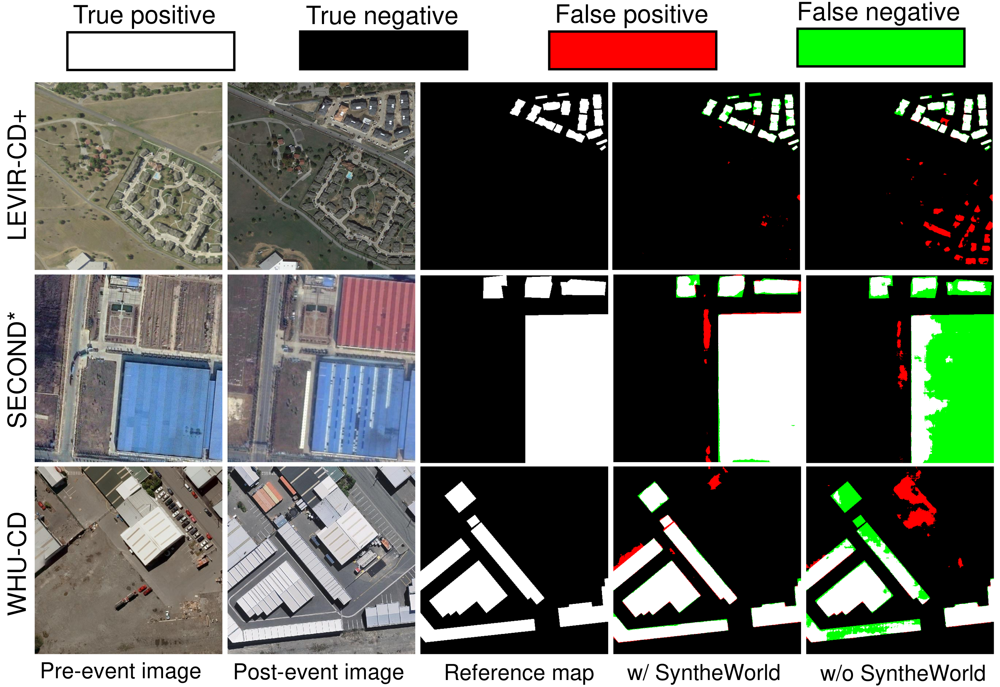

# SyntheWorld
Official repository of "SyntheWorld: A Large-Scale Synthetic Dataset for Land Cover Mapping and Building Change Detection"  
[paper, supp] [[arXiv](https://arxiv.org/abs/2309.01907)]


## Updates
**[2023/08/31]** We are happy to announce that SyntheWorld was accepted at WACV2024. Dataset will be released soon!


## Abstract
Synthetic datasets, recognized for their cost effectiveness, play a pivotal role in advancing computer vision tasks and techniques. However, when it comes to remote sensing image processing, the creation of synthetic datasets becomes challenging due to the demand for larger-scale and more diverse 3D models. This complexity is compounded by the difficulties associated with real remote sensing datasets, including limited data acquisition and high annotation costs, which amplifies the need for high-quality synthetic alternatives. To address this, we present SyntheWorld, a synthetic dataset unparalleled in quality, diversity, and scale. It includes 40,000 images with submeter-level pixels and fine-grained land cover annotations of eight categories, and it also provides 40,000 pairs of bitemporal image pairs with building change annotations for building change detection task. We conduct experiments on multiple benchmark remote sensing datasets to verify the effectiveness of SyntheWorld and to investigate the conditions under which our synthetic data yield advantages.

<p align="center">  </p>

<p align="center">  </p>

<p align="center">  </p>

<p align="center">  </p>

### Reference
```
@misc{song2023syntheworld,
      title={SyntheWorld: A Large-Scale Synthetic Dataset for Land Cover Mapping and Building Change Detection}, 
      author={Jian Song and Hongruixuan Chen and Naoto Yokoya},
      year={2023},
      eprint={2309.01907},
      archivePrefix={arXiv},
      primaryClass={cs.CV}
}
```
